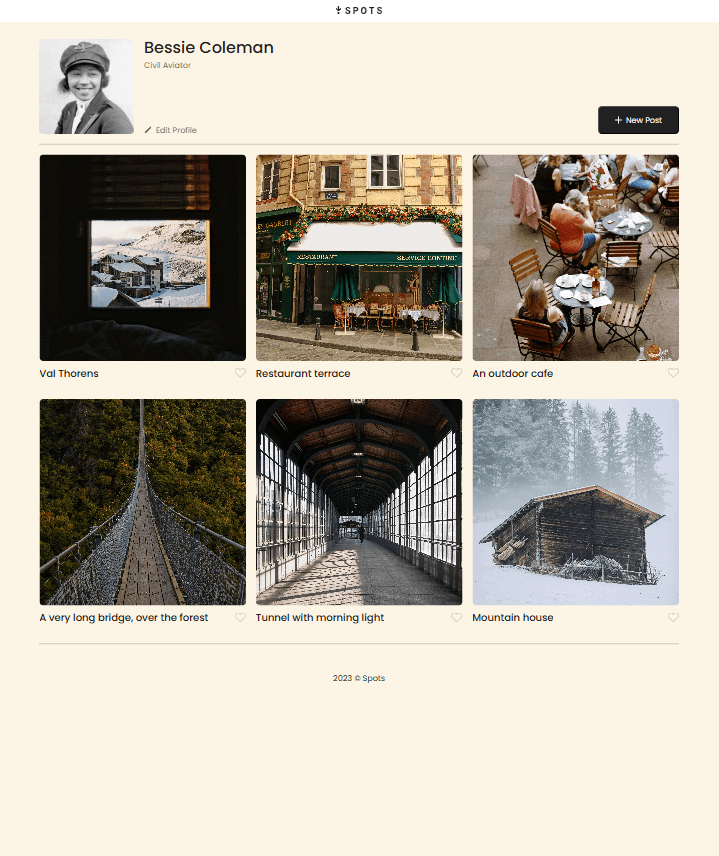
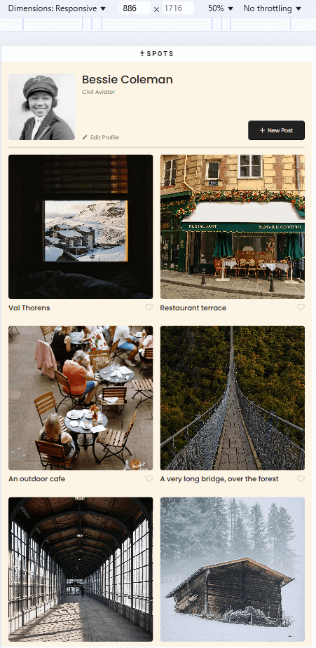
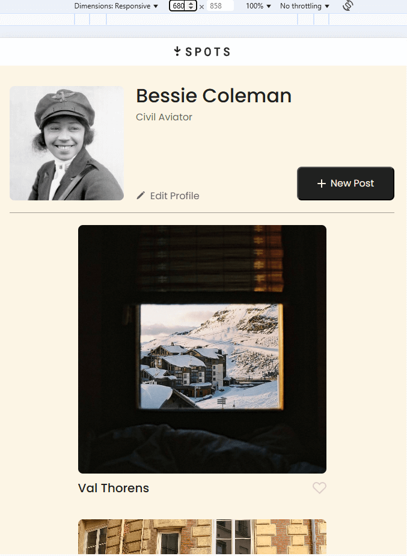

# Project 3: Spots

**Intro**

**Description:** Spots is the third project of the Software Engineering Program at TripleTen. Initially created using HTML and CSS based on a design brief via Figma, it now incorporates JavaScript, enabling dynamic interactions.
**Responsive:** The unique design features responsive technology, making it convenient for users with different devices and screen sizes, including desktops, tablets, and even smartphones with a screen size of 320px and above. The site is carefully structured with various user devices in mind!
**Personal Customization:** Spots functions like a social media profile where users can effortlessly upload a profile picture, add and delete images, and title each image.

## Project feautures

- Semantic HTML5
- Flexbox/Grid
- Positioning
- Flat BEM file structure
- A custom form
- Responsive design
- CSS @imports
- CSS @media queries
- Primary and fallback fonts
- Mobile Optimzation
- Figma-based structure
- Text overflow implemented
- Hover and transition properties
- JavaScript-powered interactivity
- API integration for persistent data storage

## New Features with JavaScript

Spots now incorporates JavaScript for improved functionality:

- Edit Avatar & Profile Description: Users can update their profile avatar and description, making the site more personal and interactive.

- Image Management: Users can upload images and delete them, ensuring full control over their profile content.

- API Integration: The project now communicates with an API, allowing persistent updates—ensuring that profile changes, including images and text edits, stay saved across refreshes.

## Deployment & System Requirements

System Requirements
To run this project locally or on a server, you’ll need:

A modern web browser (Chrome, Firefox, Edge, Safari)
A text editor (VS Code, Sublime Text, or Atom)
(Optional) A local development server (e.g., Live Server in VS Code)

## Local installation and Usage

1. Clone the Repository
2. Navigate to the Project Folder
3. Open index.html in a browser

##Deployment

This webpage is deployed to Github Pages

[Deployment Link](https://tylub001.github.io/se_project_spots/)

**Images**

[Google Drive Loom Video Link](https://drive.google.com/file/d/1ZQPn5MAfBkoXSNuMt-zQB2kWDy94soEQ/view?usp=sharing)

[YouTube Project Demo Link](https://youtu.be/H2du7H3zJcs)
